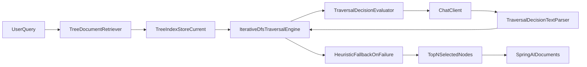

# Architecture Guide

This document explains how `spring-ai-tree-retriever` is organized and how data flows through it.

## Module responsibilities

### `core`
Core immutable records and contracts used everywhere:
- `DocumentTreeNode`
- `TreeIndex`
- `TraversalDecision`
- `TraversalResult`
- `StoreSnapshot`
- `StoreStats`

Why this matters: immutable records make concurrent reads safer and easier to reason about.

### `api`
Main extension contracts and adapters:
- `TraversalEngine`
- `TraversalDecisionEvaluator`
- `TreeIndexBuilder`
- `TreeDocumentRetriever`

Why this matters: consuming apps can swap implementations without rewriting core flow.

### `indexing`
Index creation pipeline:
- parsers (`TextDocumentParser`, `MarkdownDocumentParser`, `SpringAiDocumentParser`)
- chunking (`OverlappingTextChunker`, `SplitterConfig`)
- orchestration (`DocumentProcessingPipeline`)
- tree building (`DefaultTreeIndexBuilder`)

Why this matters: it transforms raw documents into a compact, queryable tree.

### `indexing/summarization`
LLM summary generation:
- `ChatClientSummarizationEngine`
- strict JSON parsing + retry + fallback

Why this matters: parent nodes keep compressed meaning so retrieval can navigate faster.

### `traversal`
Query-time navigation:
- `IterativeDfsTraversalEngine`
- `ChatClientTraversalDecisionEvaluator`
- `TraversalDecisionTextParser`

Why this matters: retrieval never depends on recursion depth and can stop by deadline.

### `store`
Thread-safe index state:
- `InMemorySnapshotStore`
- `InMemoryTreeIndexStore`
- `TreeIndexStore`

Why this matters: reads use published snapshots while writes update safely.

### `spring`
Boot integration:
- `TreeRetrieverAutoConfiguration`
- `TreeRetrieverProperties`
- actuator endpoint (`treeRetriever`)

Why this matters: starter users get plug-and-play beans with override hooks.

## Indexing flow

## Retrieval flow

## Threading and failure strategy

- Traversal uses an executor for evaluator calls with a global deadline.
- If evaluator/LLM times out or fails, traversal falls back to deterministic token-overlap scoring.
- Snapshot store publishes immutable snapshots on successful mutation.
- Retrieval returns best-so-far rather than failing hard.

## Why these design choices

- Vectorless RAG keeps infrastructure simple for learning and experimentation.
- Bottom-up summarization reduces token cost at retrieval time.
- Iterative DFS avoids recursion limits and supports deadline control.
- Spring AI abstractions keep provider integrations replaceable.
